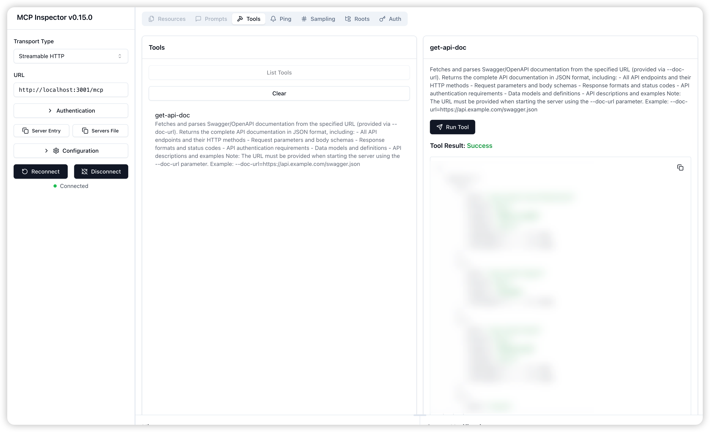

# api-mcp-server

English | [简体中文](README.zh-CN.md)

<div align="center">
  <h1>API MCP Server</h1>
  <p>A Swagger/OpenAPI Documentation Retrieval Tool Based on MCP (Model Context Protocol)</p>
  <br />
</div>

<br/>

This is a Swagger/OpenAPI documentation retrieval tool based on MCP (Model Context Protocol). It can fetch and parse Swagger/OpenAPI documentation from specified URLs, intelligently clean and optimize the documentation to reduce token consumption, and provide it to intelligent IDEs (such as Cursor) in a standardized format. The tool supports multiple transport methods, making it easy for IDEs to retrieve and understand API documentation, enabling intelligent features such as interface suggestions, auto-completion, and code generation.

## ✨ Features

- Intelligent Document Processing

  - Fetch Swagger/OpenAPI documentation from remote URLs
  - Support for Swagger 2.0 and OpenAPI 3.x formats
  - Intelligent cleaning and optimization of document structure to reduce token consumption
  - Extract key API information including endpoints, parameters, response formats, etc.

- IDE-Friendly Design

  - Standardized API description format
  - Automatic generation of example requests and responses
  - Intelligent parameter hints and type inference
  - Support for code auto-completion and generation

- Multiple Transport Methods
  - stdio: Standard input/output mode for command-line tools
  - http: HTTP server mode with RESTful interface support
  - sse: Server-Sent Events mode for real-time communication

## Getting Started

### MacOS / Linux

```json
{
  "mcpServers": {
    "api-mcp-server": {
      "command": "npx",
      "args": [
        "-y",
        "api-mcp-server",
        "--transport",
        "stdio",
        "--doc-url",
        "xxx"
      ]
    }
  }
}
```

### Windows

```json
{
  "mcpServers": {
    "api-mcp-server": {
      "command": "cmd",
      "args": [
        "/c",
        "npx",
        "-y",
        "api-mcp-server",
        "--transport",
        "stdio",
        "--doc-url",
        "xxx"
      ]
    }
  }
}
```

### Command Line Arguments

- `--transport <stdio|http|sse>`: Choose transport method (default: stdio)
- `--port <number>`: HTTP/SSE server port (default: 3000)
- `--doc-url <url>`: Swagger/OpenAPI documentation URL (required)

### Usage Examples

#### 1. Basic Usage

```bash
# Using stdio mode (default)
npx -y api-mcp-server --doc-url https://api.example.com/swagger.json

# Using HTTP mode
npx -y api-mcp-server --transport http --doc-url https://api.example.com/swagger.json

# Using SSE mode with custom port
npx -y api-mcp-server --transport sse --port 3001 --doc-url https://api.example.com/swagger.json
```

## 💻 Development

```bash
# Clone the repository
git clone https://github.com/bluechenchenchen/api-mcp-server.git

# Install dependencies
pnpm install

# Run in development mode
pnpm dev

# Build
pnpm build
```

## Debugging

Use @modelcontextprotocol/inspector

```bash
npx @modelcontextprotocol/inspector
```



## Run Example

```bash
pnpm example
```

## 📋 Requirements

- Node.js >= 16.0.0
- npm >= 6.0.0 or pnpm >= 6.0.0

## 📄 License

MIT
